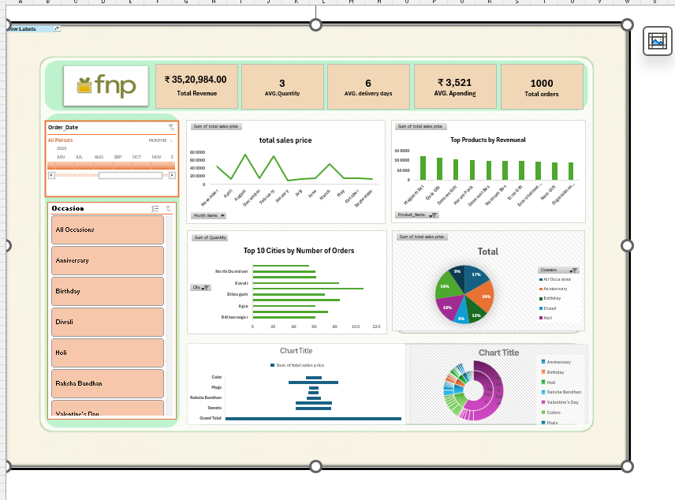

# Sales-Data-Cleaning-Modeling-Analysis
Sales data cleaning, column creation, pivot table analysis, data modeling and PowerPoint dashboard project using Excel.
## Project Overview

This project focuses on sales data cleaning, column creation, Pivot Table analysis, data modeling, and dashboard creation using Excel.

## Data Cleaning

The raw sales data was cleaned using Excel.

- Removed duplicate values
- Handled missing values
- Corrected data formats
- Standardized data
- Removed unnecessary data

## Column Creation

New columns were created for analysis:

- Month
- Day Difference
- Other required calculated columns

## Pivot Table Analysis

Pivot Tables were created to analyze sales performance, customer information, product performance, and monthly trends.

## Data Modeling

Data modeling was performed to establish relationships between the required tables and support analysis.

## Dashboard

A dashboard was created using PowerPoint and added to the Excel project for visual analysis.

## Tools Used

- Microsoft Excel
- Pivot Tables
- Data Modeling
- Microsoft PowerPoint

## Key Learning

This project helped me gain practical experience in data cleaning, data transformation, Pivot Table analysis, data modeling, and dashboard creation.
